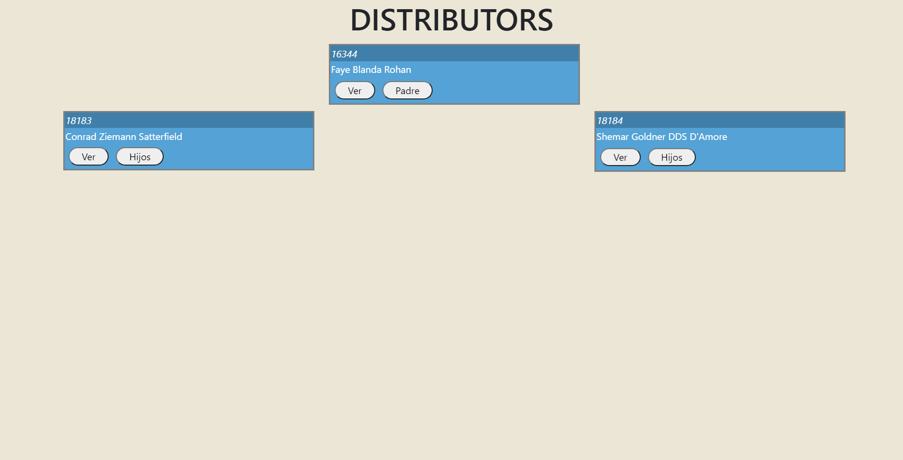

# GeneologyTree

This project was generated with [Angular CLI](https://github.com/angular/angular-cli) version 11.2.5.

Para poder desarrollar este proyecto se utilizo:
<ul>
    <li>Angular</li>
    <li>Boostrap</li>
    <li>CSS</li>
</ul>

El siguiente proyecto muestra una intefaz de usuario con un forma de diagrama de arbol binario, los datos utilizados para esta estructura se encuentra en un archivo json donde contiene n niveles de profundida, por lo tanto, la estructura cuenta con la opción de poder desplazarse a traves de los niveles y mostrar la información de cada nodo.

Así como tambien tiene la opción de poder navegar de regreso hacia el padre anterior.

A continuación se muestra la vista Web y la vista movil de como se muestra el resultado final. este tambien lo puede visualizar en el siguiente enlace ya sea en navegador de escritorio o navegador móvil.

<a href="https://wsantos35.github.io/Geneology-Tree/">Geneology-Tree</a>

<b>Vista Web</b>

<b>Vista Movil</b>

